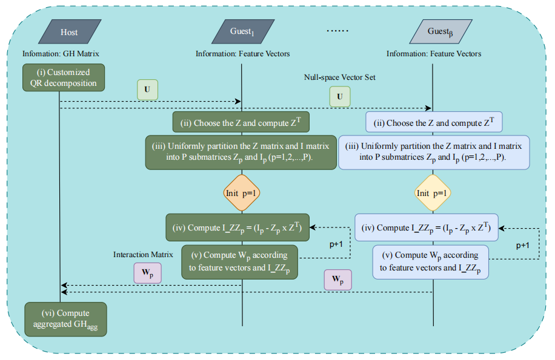

<p align="center">
    
</p>


<h1 align="center">EVFeX: An Efficient Vertical Federated XGBoost Algorithm Based on Optimized Secure Matrix Multiplication (SIGPRO 2024)</h1>

Fangjiao Zhang <sup>a</sup>,  Li Wang <sup>a</sup>, Chang Cui <sup>a</sup>, Qingshu Meng <sup>a</sup>, Min Yang <sup>b</sup>

**Keywords**: Vertical Federated Learning, Secure Multi-Party Computation, XGBoost, Secure Matrix Multiplication, QR decomposition.

<sup>a</sup> Wuhan Tianyu Information Industry Co., Ltd, Wuhan, China

<sup>b</sup> School of Cyber Science and Engineering, Wuhan University, Wuhan, China

**Abstract**: Federated Learning is a distributed machine learning paradigm that enables multiple participants to collaboratively train models without compromising the privacy of any party involved. Currently, vertical federated learning based on XGBoost is widely used in the industry due to its interpretability. However, existing vertical federated XGBoost algorithms either lack sufficient security, exhibit low efficiency, or struggle to adapt to large-scale datasets. To address these issues, we propose EVFeX, an efficient vertical federated XGBoost algorithm based on optimized secure matrix multiplication, which eliminates the need for time-consuming homomorphic encryption and achieves a level of security equivalent to encryption. It greatly enhances efficiency and remains unaffected by data volume. The proposed algorithm is compared with three state-of-the-art algorithms on three datasets, demonstrating its superior efficiency and uncompromised accuracy. We also provide theoretical analyses of the algorithm's privacy and conduct a comparative analysis of privacy, efficiency, and accuracy with related algorithms.

## The Table of Contents


:wink: If Twin-sight is helpful to you, please star this repo. Thanks! :hugs: 
- [:grimacing: Dependencies and installation](#grimacing-dependencies-and-installation)
- [:partying\_face: How to run](#partying_face-how-to-run)
- [:evergreen\_tree: Detail of our method](#evergreen_tree-detail-of-twin-sight)
- [:smiley: Citation](#smiley-citation)
- [:phone: Contact](#phone-contact)

##  :grimacing: Dependencies and installation
Before running or modifying the code, you need to:
- Make sure Anaconda or Miniconda is installed.
- Clone this repo to your machine.
  
  ```
  # git clone this repository
  git clone https://github.com/fungizhang/EVFeX.git
  cd EVFeX

  # create new anaconda env 
  conda create -n EVFeX python=3.9 -y
  conda activate EVFeX
  ```

- required packages in `requirements.txt`
  ```
  # install python dependencies
  pip install -r requirements.txt
  ```

## :partying_face: How to run:

```
cd ./kernel/examples/demo/vert_sbt/
python wefe-vert-sbt.py
```


In ```/kernel/examples/demo/vert_sbt/binary_config.yaml```, you can change the hyper-parameters and some settings. 
```
### dataset BREAT
data_promoter: "data/breast_vert_promoter.csv"
data_provider: "data/breast_vert_provider.csv"
### dataset LOAN
#data_promoter: "data/default_credit_vert_promoter.csv"
#data_provider: "data/default_credit_vert_provider.csv"
### dataset FINANCE
#data_promoter: "data/dataset_ap.csv"
#data_provider: "data/dataset_pp.csv"

idx: "id"
label_name: "y"
data_promoter_train: "breast_vert_promoter_train"
data_promoter_val: "breast_vert_promoter_val"
data_provider_train: "breast_vert_provider_train"
data_provider_val: "breast_vert_provider_val"

eval_type: "binary"
task_type: "classification"
loss_func: "cross_entropy"
tree_depth: 5
tree_num: 3
learning_rate: 0.1
```

## :evergreen_tree: Detail of our method:

Our code framework is based on the open-source code of ```WeFe``` (https://github.com/tianmiantech/WeFe). For a detailed introduction to WeFe, please refer to ```README_WeFe.md```.


## :smiley: Citation
If our work is useful for your research, please consider citing:

Under Review...

## :phone: Contact
If you have any questions, please feel free to reach me out at `fungizhang@gmail.com`. 
